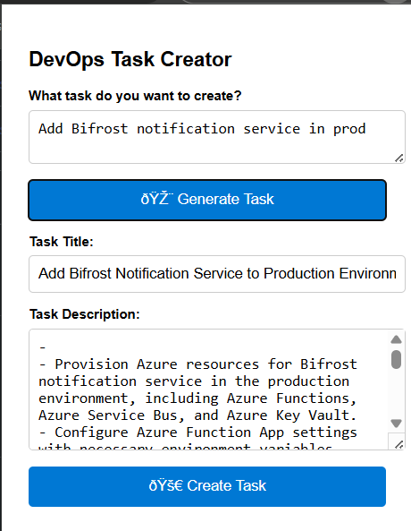
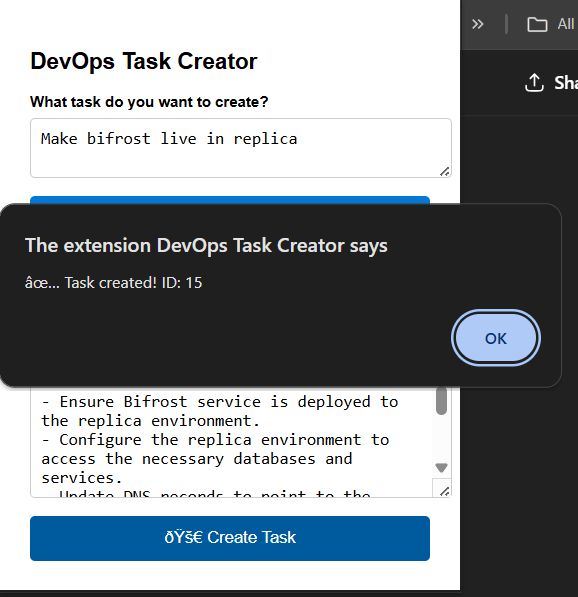
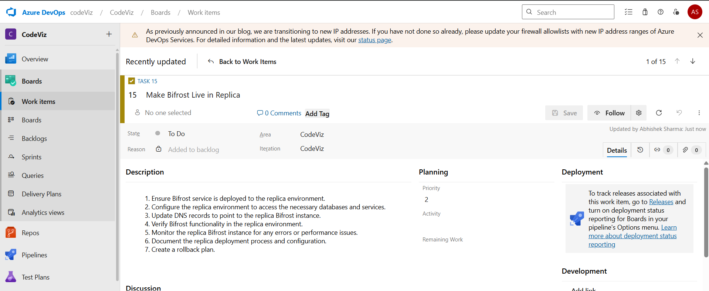

# 🔧 Azure DevOps Task Creator Extension

Easily generate and create Azure DevOps tasks from natural language using AI.


---

## 🖼️ Screenshots

### 🔹 Extension Popup


### 🔹 Generated Task Preview


### 🔹 Generated Task Preview


## ✨ Features

- 🧠 Uses Gemini API to generate well-formatted Azure DevOps tasks
- 📋 Creates tasks directly in Azure DevOps with correct title and bullet-pointed steps
- 👤 Auto-assigns tasks to the current user
- 🌐 Simple and clean UI inside a browser extension

## 🚀 Setup

### 1. Clone the repository

```bash
git clone https://github.com/abhishek-sharma-2001/devops-task-extension.git
cd devops-task-extension

